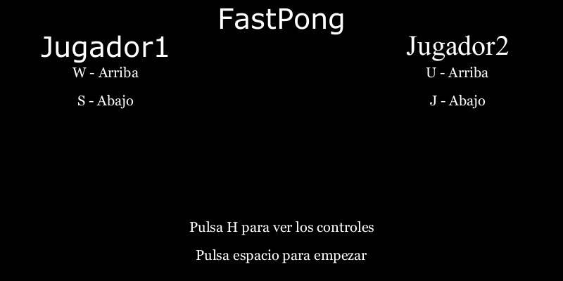

# Memoria Practica 1 CIU - FastPong
Creado por Marco Nehuen Hernández Abba



### Contenido
- Trabajo realizado
- Herramientas y Referencias


### Trabajo realizado
***FastPong es una variante del Pong en el que la posición y la velocidad del jugador es importante ya que la partida se hace más rapida hasta que se marque 1 punto***

Se describe según los objetivos propuestos dentro de la tarea pedida.

``` 
La propuesta realizada debe incluir al menos: rebote, marcador, sonido, movimiento inicial aleatorio, 
admitiendo aportaciones propias de cada estudiante.
```
Inicialmente se comentará la interfaz visual
### Interfaz


Toda la parte visual, menu = 0 es el menu, menu = 1 es el juego
```
int gui(int menu){
  if (menu != 0){
    for(int i = 0; i < width; i=i+20){
      line(width/2,0+i,width/2,12+i);
    }
    
    //jugador derecho
    rect(width-20,pos2,10,50);
    //jugador izquierdo
    rect(20,pos1,10,50);
    rect(cir_x, cir_y, 10,10);
    fill(255);
  
    //marcador 1
    marcador(marc1,width-70,25);
    
    //marcador 2
    marcador(marc2,40,25);
    
  } else {
    //texto
    
    textAlign(CENTER,CENTER);
    textFont(createFont("Verdana",40));
    ...
  }
  return menu;
      
}
```
Cuando ganas, el juego se pausa y muestra en un cuadrado quien es el ganador.
```

void victoria(){
  mov_x = 0;
  mov_y = 0;
  cir_y = -100;
    
  fill(0);
  rect(width/2-100,height/2-100,200,100);
  fill(255);
  textFont(createFont("Georgia",15));
  textAlign(CENTER, CENTER);
  text("El ganador es:", width/2,height/2-50);
  if (marc1 > marc2){
    textFont(createFont("Georgia",20));
    text("Jugador1", width/2,height/2-40);
  } else {
    textFont(createFont("Georgia",20));
    text("Jugador2", width/2,height/2-40);
  }
  
  textFont(createFont("Georgia",30));
  textAlign(CENTER, CENTER);
  text("Pulsa R para reiniciar", width/2,height-30);
}
```
### Rebote
Para los techos, si esta arriba (cir_y en 0) lo cambio de dirección (-mov_y) y viceversa, solo que se tiene en cuenta el tamaño de la bola, (height-10)
Para los lados, si es fondo sumo puntuación.
```
void rebote(){
  //hacia abajo
  if(cir_y >= height-10) {
    cir_y = height-10;
    mov_y = -mov_y;
    ang = -ang;
    ...
  }
  //hacia arriba
  if(cir_y < 0) {
    cir_y = 0;
    mov_y = -mov_y;
    ang = -ang;
    ...
  }
  if(cir_x > width || cir_x < 0) {
    ...
    if(cir_x > width){ 
      marc1++;
    }else{
      marc2++;
    }
    ...
  }
```

Para los jugadores, si colisionan (su posición en xy coincide con la pelota) cambian de dirección, también cambia su angulo (ver en [Aportaciones propias](#Aportaciones-propias))

### Marcador
Hecho con rect() se llama desde gui() con el numero y la posición xy del marcador.
```
  marcador(marc1,40,25);
  marcador(marc2,width-70,25);
``` 
```
void marcador(int n,int x, int y){
  switch(n){
    case 0:
      rect(x,y,10,50);
      rect(x+10,y,20,10);
      rect(x+10,y+40,20,10);
      rect(x+20,y+10,10,40);
    break;
    case 1:
      rect(x+10,y,10,50);
    break;
    ...
  }
}
```

### Sonido
Hay tres sonidos en el juego.
- sounda (rebote pelota con jugador 1)
- soundb (rebote pelota con jugador 2)
- start (cada vez que se pasa del menu al juego o cuando se marca punto)

```
void setup() {
  ...
  playera = new SoundFile(this,"sounda.wav");
  playerb = new SoundFile(this,"soundb.wav");
  start = new SoundFile(this,"start.wav");
  ...
}
```
```
void playSound(){
  switch (sound) {
    case "playera":
      playera.play();
      break;
    case "playerb":
      playerb.play();
      break;
    case "start":
      start.play();
      break;
  }
}
```
``` 
void collision(){
  //si la bola toca el jugador, rebota 
  if((cir_x >= 10 && cir_x <= 20) && (cir_y >= pos1 && cir_y <= pos1+50)){
    ...
    sound = "playera";
    thread ("playSound");
  }
  //jugador 2
  if((cir_x >= width-30 && cir_x <= width-20) && (cir_y >= pos2 && cir_y <= pos2+50)){
    ...
    sound = "playerb";
    thread ("playSound");
  }
}
```
```
if (key == ' '){
      if(menu == 0){
        sound = "start";
        thread ("playSound");
      }
      menu = 1;
    }
```
```
void rebote(){
  //llega a la izquierda o derecha, puntuacion para el de la izquierda
  if(cir_x > width || cir_x < 0) {
    ...
    //println("derecha");
    sound = "start";
    thread ("playSound");
  }
  ...
}
```
### Movimiento inicial aleatorio
Para decidir si va hacia la derecha o a la izquierda cuando se marca el punto, se tiene en cuenta unas condiciones especificas (ver en [Aportaciones propias](#Aportaciones-propias))

### Aportaciones propias
**Colisión**

Para hacer la colisión, decidí hacer que si rebota en la parte alta del jugador vaya hacia arriba y en la parte baja hacia abajo, para ello, tuve en cuenta la posicion de la pelota con la del jugador, cuando esta colisión revisa si esta arriba o abajo.
```
  if((cir_x >= 10 && cir_x <= 20) && (cir_y >= pos1 && cir_y <= pos1+50)){
    cir_x = 20.1; //evitar sobrecolision
    ...
    if(mov_y >= 0 && cir_y-pos1 <= 25){
      mov_y *= -1;
    }
    if(mov_y <= 0 && cir_y-pos1 >= 25){
      mov_y *= -1;
    }
    ...
  }
  if((cir_x >= width-30 && cir_x <= width-20) && (cir_y >= pos2 && cir_y <= pos2+50)){
    cir_x = width-30.1; //evitar sobrecolision
    ...
    ang = -2+4*((cir_y-pos2)/50);
    if(mov_y >= 0 && cir_y-pos2 <= 25){
      mov_y *= -1;
    }
    if(mov_y <= 0 && cir_y-pos2 >= 25){
      mov_y *= -1;
    }
    ...
  }
}
```
Y a partir del cuanto de lejos del medio estaba, tambien hice que cogiese un angulo diferente, cuanto más arriba más alto, y cuanto más abajo, más bajo.
```
  if((cir_x >= 10 && cir_x <= 20) && (cir_y >= pos1 && cir_y <= pos1+50)){
    ...
    ang = -2+4*((cir_y-pos1)/50);
  }
  //jugador 2
  if((cir_x >= width-30 && cir_x <= width-20) && (cir_y >= pos2 && cir_y <= pos2+50)){
    ...
    ang = -2+4*((cir_y-pos2)/50);
  }
 ```
 
 
 En el verde, la bola puede ir hacia abajo o hacia arriba depende de si esta más por arriba o por abajo desde el medio.
 El angulo se añade dentro del draw() en el movimiento de la bola.
 
 Para acabar, cada vez que colisiona la pelota, se añade velocidad en la bola, añadiendo la restricción de que no puede pasar de 10 de aceleración,
 ya que podría transpasar al jugador al ser de anchura de 10.
 ```
    if(mov_x*1.1 <= 10){
      mov_x = -mov_x*1.1; //mov_x no puede superar 10
    } else{
      mov_x = -mov_x;
    }
 ```
 Junto con su velocidad, el color de la pelota se va volviendo rojo con cada golpe hasta tener el rojo completo (255,0,0)
 ```
 if(col-5 > 0){
      col-= 15;
    }
 ```
**Movimiento inicial aleatorio**

Cuando la bola llega al extremo derecho o izquierdo, se coloca en el medio en una posición aleatoria, con una pequeña pausa, la pelota puede rebotar en la parte baja y alta en su pausa, y tambien tiene la velocidad inicial, si cuando acaba esa pausa su movimiento (mov_y) es positivo, el movimiento es hacia la derecha, si no, a la izquierda.

```
  //pelota en el medio, minipausa
  if (stop == true){
    if (tiempo <= 0){
      stop = false;
      if(mov_y >= 0){  
        mov_x = 3;
        mov_y = 2;
      } else{
        mov_x = -3;
        mov_y = -2;
      }
      tiempo = 30;
    }
    tiempo -=1;
  }
```

### Herramientas y referencias.
**Gif Animator**

Para sacar el gif solicitado, con el siguiente codigo, comentado dentro de la practica.
```
void setup() {
  //gif
  //ficherogif = new GifMaker(this, "animacion.gif");
  //ficherogif.setRepeat(0);        // anima sin fin
}
``` 
```
void draw() {
  ...
  //ficherogif.setDelay(1000/60);
  //ficherogif.addFrame();
  }
```
```
void mousePressed() {
  //ficherogif.finish();          // Finaliza captura y salva
}
```
El link de descarga puesto en la Práctica no funcionaba, por lo que lo descargué de otro [repositorio](https://github.com/extrapixel/gif-animation/tree/3.0).

**Referencias**

 [Explicación de la practica 1](https://github.com/otsedom/otsedom.github.io/blob/main/CIU/P1/README.md#Introducci%C3%B3n)
 
 [Referencias de Proccesing](https://processing.org/reference/)
 
 [Control simultaneo con keyPressed()](https://discourse.processing.org/t/keypressed-for-multiple-keys-pressed-at-the-same-time/18892)
 
